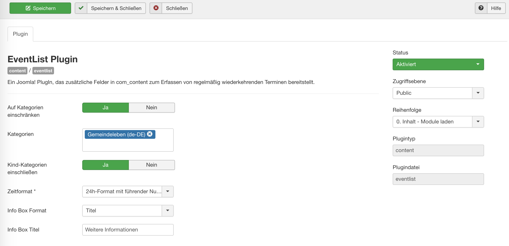
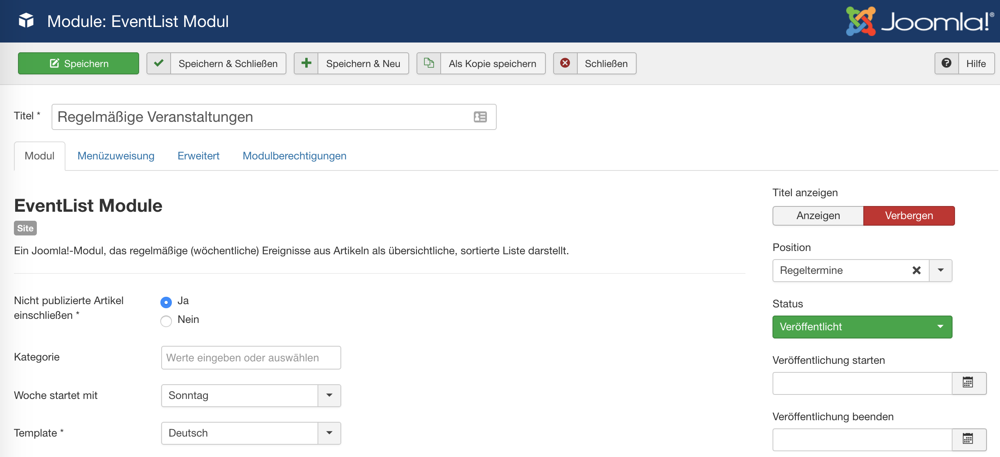

# Konfiguration

## Plugin-Konfiguration

Das Plugin muss zunächst aktiviert werden (*Erweiterungen - Plugins*).

{ .off-glb }

Man kann das Plugin auf die Artikel bestimmter Kategorien einschränken. Außerdem kann man auswählen, ob Unterkategorien der gewählten Kategorien eingeschlossen werden sollen.

Ferner kann das Uhrzeit-Format ausgewählt werden. Diese Auswahl bestimmt das Aussehen der Anfangs- und Endzeit während der Eingabe der Event-Infos. Entsprechen diese Eingaben nicht diesem Format, wird eine Fehlermeldung ausgegeben.

Folgende Uhrzeit-Formate stehen zur Auswahl:

- 24-Stunden-Format mit führender Null, z.B. 09:00
- 12-Stunden-Format mit führender Null, z.B. 09:00 AM
- 24-Stunden-Format ohne führende Null, z.B. 9:00
- 12-Stunden-Format ohne führende Null, z.B. 9:00 AM
- Freies Format (nicht empfohlen!): Hier erscheint ein zusätzliches Eingabefeld, wo eine Regex-Formatierung eingegeben werden kann. Bitte stellen Sie sicher, dass das Format auch von der PHP DateTime-Funktion als Uhrzeitformat erkannt wird, sonst ist ein Abspeichern der Event-Info nicht möglich.

Zuletzt können Sie festlegen, ob die Infobox mit Titel dargestellt wird (Voreinstellung: "Info") oder nicht.

## Module-Konfiguration

{ .off-glb }

### Parameter

The following parameters are available for Module configuration (Extensions - Modules):

- Nicht publizierte Artikel einschließen: Schließt Artikel, die die entsprechenden Felder haben, aber nicht publiziert sind, in die Liste ein (z.B. wenn ein Artikel inhaltlich noch nicht fertig ist); Voreinstellung: Nein
- Kategorie: Auswahl der Kategorien, deren Artikel für die Event-Liste berücksichtigt werden sollen; wenn leer, werden alle Kategorien berücksichtigt
- Woche startet mit: Legt fest, ob die Event-Liste mit Sonntag oder Montag beginnt; Voreinstellung: Sonntag
- Template: Auswahl der Darstellung der Event-Liste; International = ohne Angaben wie "Uhr"; Deutsch = mit Angabe "Uhr" nach der Uhrzeit; Frei = frei konfigurierbar
{ style="width:100px", align=right }
- Wenn frei konfigurierbar gewählt wurde, erscheinen weitere Felder:
    - Zeitentrenner: Zeichenkette zwischen Anfangs- und Endzeit
    - Nach Zeit: Zeichenkette nach der Zeitangabe
    - Vor Kommentar: Zeichenkette vor dem Kommentar
    - Nach Kommentar: Zeichenkette nach dem Kommentar
    - Vor Titel: Zeichenkette vor dem Titel

### Systematik für frei konfigurierte Ausgabe

Startzeit`<Zeitentrenner>`Endzeit`<nach Zeit>` `<vor Kommentar>`Kommentar`<nach Kommentar>` `<vor Titel>`Titel

Beispiel:

18:30` to `19:20` Uhr` ` (`außer in Schulferien`)` `: `Chorprobe
