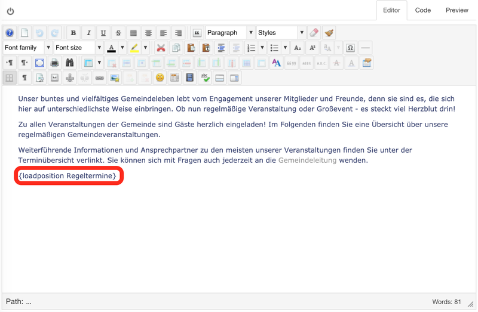

# Bedienungsanleitung

EventList für [Joomla 4](https://www.joomla.de){ :target="_blank" } ist ein Joomla!-Paket, das wöchentlich wiederkehrende Veranstaltungen wie Chorproben, Gruppenstunden, etc. automatisch als übersichtliche Liste darstellt und auf die Detail-Beschreibung verlinkt.

{ .off-glb }

Joomla! EventList ist eine Paketinstallation und besteht aus zwei Erweiterungen:

- Ein Plugin, welches jedem Artikel zusätzliche Felder wie Kontaktperson, E-Mail-Adresse, Telefonnummer, Wochentag, Startzeit, usw. zur Verfügung stellt. Diese Felder werden dann am Ende des Artikels in einer übersichtlichen Infobox angezeigt. Das Plugin kann auch ohne das Modul verwendet werden.
- Ein Modul, welches alle zur Anzeige ausgewählten Artikel als übersichtliche Liste darstellt (siehe Bild). Dieses Modul kann an jeder beliebigen Stelle eingebunden werden und natürlich auch per CSS angepasst werden. Aus der Liste heraus wird auf den Artikel mit der Detailbeschreibung verlinkt. Das Modul benötigt das Plugin!

## Besonderheiten

### EventList PlugIn Besonderheiten

{ style="width:100px", align=right }

- Auswahl, ob ein Artikel in der Event-Liste dargestellt wird oder nicht
- Felder für Kontaktperson, E-Mail-Adresse, Telefonnummer, Zielgruppe und Ort (relevant für die Anzeige im Artikel)
- Weitere Felder für Wochentag, Startzeit, Endzeit, Kommentar (zusätzlich relevant für die Anzeige im Modul EventList)
- Verschiedene voreingestellte Zeitformate: 24h-Format mit oder ohne führender Null, 12h-Format mit oder ohne führender Null
- Alternativ: Frei konfiguierbares Zeitformat
- Regex-basierte Prüfung des Eingabeformats von Start- und Endzeit
- Ausgabe als Infobox am Ende des Artikels (siehe Bild), konfigurierbar mit oder ohne Kopfzeile / Titel 

### EventList Modul Features

- Anzeige aller ausgewählten Artikel als übersichtliche, kompakte Event-Liste
- Möglichkeit, nicht publizierte Artikel in die Event-Liste aufzunehmen (wenn z.B. kein Artikelinhalt zur Verfügung steht, das Event aber dennoch in der Liste angezeigt werden soll)
- Verschiedene voreingestellte Listendarstellungen: Deutsch (fügt das Wörtchen "Uhr" hinzu) oder international
- Alternativ: Frei konfigurierbares Listenformat
- Verlinkung auf die Detailbeschreibung (nur im Falle von bereits publizierten Artikeln)
- Formatierung via eigenem CSS

## Installation

Laden Sie das letzte stabile Release von Github als ZIP-File herunter. Es stehen zwei Dateien zum Herunterladen zur Verfügung:

- Empfehlung ist, das EventList-Paket pgk_eventlist herunterzuladen, denn es beinhaltet sowohl das Plugin zum Hinzufügen und Darstellen von Eventinformationen in einem Artikel als auch das Modul zum Erstellen einer Übersichtsliste aller Events.
- Das Plugin plg_content_eventlist kann auch für sich installiert und verwendet werden. Dann ist es aber nur möglich, Eventinformationen pro Artikel zu erfassen und darzustellen, es kann aber keine Übersichtsliste erstellt werden.

!!! note "Hinweis"
    Bitte installieren Sie niemals das Plugin für sich, wenn Sie planen, das Paket zu installieren! Das Paket enthält sowohl Plugin als auch Modul!

Der in Github veränderte Quelltext, der nicht als Release zur Verfügung gestellt wird, ist experimentell, daher keine Garantie, dass er funktionsfähig ist.

Installieren Sie das Paket im Joomla! Backend unter dem Menüpunkt *Erweiterungen - Installieren*.

Das Paket besteht aus zwei Erweiterungen:

- Ein Plugin namens EventList (kann auch für sich installiert werden)
- Ein Modul namens EventList (benötigt das Plugin und kann daher nicht für sich installiert werden)

{ .off-glb }

## Konfiguration

### Plugin-Konfiguration

Das Plugin muss zunächst aktiviert werden (*Erweiterungen - Plugins*).

{ .off-glb }

Man kann das Plugin auf die Artikel bestimmter Kategorien einschränken. Außerdem kann man auswählen, ob Unterkategorien der gewählten Kategorien eingeschlossen werden sollen.

Ferner kann das Uhrzeit-Format ausgewählt werden. Diese Auswahl bestimmt das Aussehen der Anfangs- und Endzeit während der Eingabe der Event-Infos. Entsprechen diese Eingaben nicht diesem Format, wird eine Fehlermeldung ausgegeben.

Folgende Uhrzeit-Formate stehen zur Auswahl:

- 24-Stunden-Format mit führender Null, z.B. 09:00
- 12-Stunden-Format mit führender Null, z.B. 09:00 AM
- 24-Stunden-Format ohne führende Null, z.B. 9:00
- 12-Stunden-Format ohne führende Null, z.B. 9:00 AM
- Freies Format (nicht empfohlen!): Hier erscheint ein zusätzliches Eingabefeld, wo eine Regex-Formatierung eingegeben werden kann. Bitte stellen Sie sicher, dass das Format auch von der PHP DateTime-Funktion als Uhrzeitformat erkannt wird, sonst ist ein Abspeichern der Event-Info nicht möglich.

Zuletzt können Sie festlegen, ob die Infobox mit Titel dargestellt wird (Voreinstellung: "Info") oder nicht.

### Module-Konfiguration

{ .off-glb }

#### Parameter

The following parameters are available for Module configuration (Extensions - Modules):

- Nicht publizierte Artikel einschließen: Schließt Artikel, die die entsprechenden Felder haben, aber nicht publiziert sind, in die Liste ein (z.B. wenn ein Artikel inhaltlich noch nicht fertig ist); Voreinstellung: Nein
- Kategorie: Auswahl der Kategorien, deren Artikel für die Event-Liste berücksichtigt werden sollen; wenn leer, werden alle Kategorien berücksichtigt
- Woche startet mit: Legt fest, ob die Event-Liste mit Sonntag oder Montag beginnt; Voreinstellung: Sonntag
- Template: Auswahl der Darstellung der Event-Liste; International = ohne Angaben wie "Uhr"; Deutsch = mit Angabe "Uhr" nach der Uhrzeit; Frei = frei konfigurierbar
{ style="width:100px", align=right }
- Wenn frei konfigurierbar gewählt wurde, erscheinen weitere Felder:
    - Zeitentrenner: Zeichenkette zwischen Anfangs- und Endzeit
    - Nach Zeit: Zeichenkette nach der Zeitangabe
    - Vor Kommentar: Zeichenkette vor dem Kommentar
    - Nach Kommentar: Zeichenkette nach dem Kommentar
    - Vor Titel: Zeichenkette vor dem Titel

#### Systematik für frei konfigurierte Ausgabe

Startzeit`<Zeitentrenner>`Endzeit`<nach Zeit>` `<vor Kommentar>`Kommentar`<nach Kommentar>` `<vor Titel>`Titel

Beispiel:

18:30` to `19:20` Uhr` ` (`außer in Schulferien`)` `: `Chorprobe

#### Einbindung des Moduls in die Webseite

Das Modul kann entweder in einer von Ihrem Template vorgegebenen Position eingebunden werden oder frei im Inhalt eines Artikels positioniert werden.

Für eine vorgegebene Template-Position wählen Sie die Position in der Liste der verfügbaren Positionen und über den Reiter "Menüzuweisung" die Seiten, auf denen das Modul eingebunden werden soll.

Für eine freie Positionierung geben Sie in der Positions-Box Ihre eigene Bezeichnung ein (z.B. "Regeltermine" wie im Bild zu sehen) und binden Sie die Event-Liste im Artikel dann über den Befehl `{loadposition regular_events}` an beliebiger Stelle ein. In diesem Fall empfiehlt es sich, im Reiter "Menüzuweisung" alle Seiten auszuwählen.

{ .off-glb }

## Nutzung

Die Nutzung des EventList-Plugins ist denkbar einfach. Sobald das Plugin aktiviert ist, erscheint bei Bearbeitung jedes Artikels ein extra Reiter namens "Kontaktperson, Ort, Zeit", wo die verfügbaren Felder bearbeitet werden können. Alle Felder sind optional, d.h. wenn keine Eingabe erfolgt, werden sie auch nicht unter dem Artikel ausgegeben.

{ .off-glb }

- In Eventliste anzeigen: Wenn ja, wird der Artikel in der Eventliste angezeigt (wenn ein Wochentag gesetzt ist); Voreinstellung: Ja
- Kontaktperson: Kontaktperson für die regelmäßige Veranstaltung
- E-Mail: E-Mail-Adresse der Kontaktperson
- Telefonnummer: Die Telefonnummer der Kontaktperson
- Zielgruppe: Die Gruppe von Menschen, die mit der Veranstaltung angesprochen werden soll
- Ort: Der Veranstaltungsort
- Wochentag: Der Wochentag der Veranstaltung
- Startzeit: Die Startzeit der Veranstaltung
- Endzeit: Die Endzeit der Veranstaltung
- Kommentar: Hinweise zur Zeit (z.B. 14-tägig)

## Bekannte Fehler

[Diese Fehler](https://github.com/UlricusR/joomla4-eventlist/issues){:target="_blank"} sind mir bekannt. Sollten Sie über weitere Fehler stolpern, können Sie diese an selber Stelle melden.

Da ich Joomla nicht mehr nutze, entwickle ich auch das Plugin nicht mehr weiter.

## Mitmachen

Sollten Sie die Entwicklung weiterführen wollen, herzlich gerne! Es steht alles auf [GitHub](https://github.com/UlricusR/joomla4-eventlist){:target="_blank"} bereit.

Ansonsten freue ich mich über jeden spendierten Kaffee...

[{ .off-glb }](https://www.buymeacoffee.com/ulricus){:target="_blank"}
[{ .off-glb }](https://www.buymeacoffee.com/ulricus){:target="_blank"}
