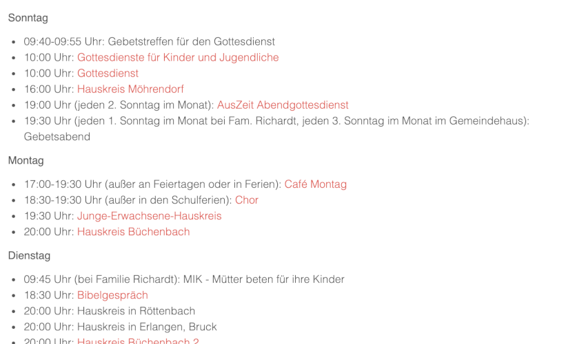
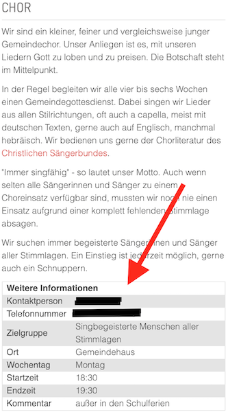
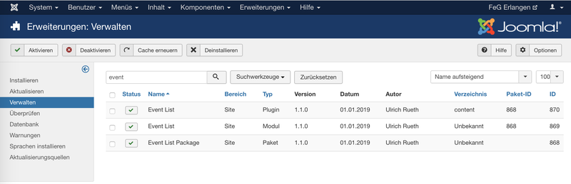
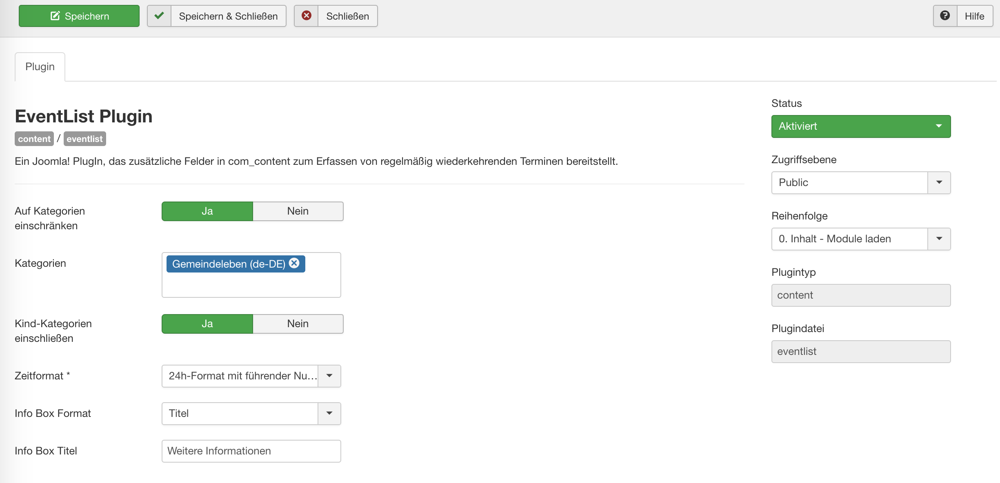
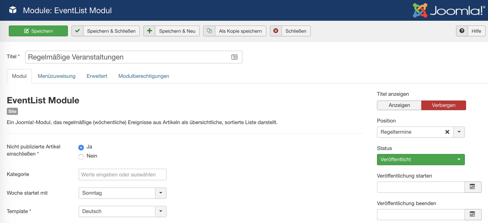
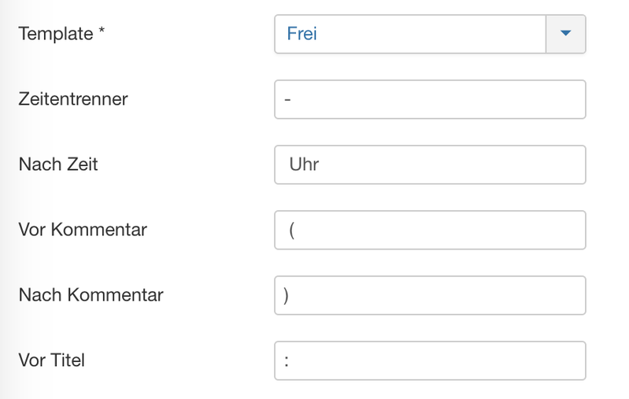
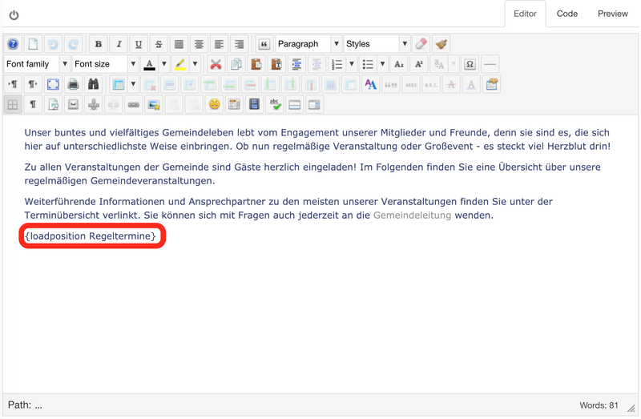
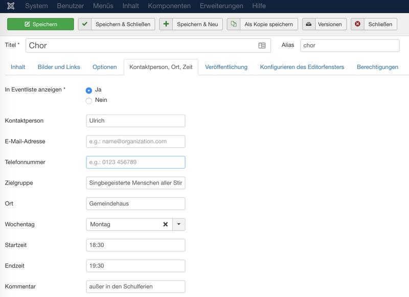

# User Manual

Joomla 4 EventList is a [Joomla!](https://www.joomla.org){:target="_blank"} package generating and displaying a clear list of weekly recurring events like rehersals, group meeting, etc., and linking to their detailed description.

{ .off-glb }

It is a package containing two extensions:

- The EventList Plugin lets you add a number of infos like contact person, e-mail-address, phone number, weekday, starting time, etc. to your article. These infos are then displayed underneath the article in a info box.
- The EventList Module screens your Joomla! articles and creates a sorted list for all articles identified as regularly recurring events. It can be used for automatically summarizing your recurring events (like bible lessons, choir rehearsal, etc.). It can be flexibly positioned and customized via CSS. The Module requires the Plugin to be installed. 

While the EventList Plugin can be used stand-alone, the EventList Module requires the Plugin to be installed.

## Features

### EventList PlugIn Features

{ style="width:100px", align=right }

- Select whether or not an article is included in the Event List
- Additional fields for contact person, e-mail address, phone number, target audience and location (only relevant for display underneath the article)
- Further fields for weekday, starting time, end time and comment (additionally relevant for displaying the article in the Event List)
- Different pre-defined time formats: 24h format with or without leading zeros, 12h format with or without leading zeros
- Alternatively free time format
- Regex based input check of starting and end time
- Frontend display as info box underneath the article (see picture), either with or without header / title

### EventList Modul Features

- Display of all selected articles as clear, compact event list
- Possibility to include non-published articles in the Event List (e.g. if no article content available, but the event should still be displayed in the Event List)
- Different pre-defined list styles: German (adds the word „Uhr“ at the end of the entry) or international
- Alternatively free list format
- Link to the detailed article (in case the article is published already)
- Fomatting via own CCS

## Installation

Download the latest stable release from Github as ZIP file. There are two ZIP files for download:

- It is recommended to download the package file pgk_eventlist, as it contains both the plugin for adding and displaying the new fields of the article as well as the module to generate the Event List.
- The Plugin plg_content_eventlist can be downloaded and installed stand-alone, in case you would like to limit the functionality to the pure display of additional fields in the article.

!!! note
    Please do never install the Plugin stand-alone, if you plan to install the Package later. The Package contains both the Plugin as well as the Module!

The source code available from Github, which is not declared as release, is highly experimental, so no guarantee that it will work.

Install the package in the Joomla! backend under *Extensions - Install*.

The package contains two extensions:

- A Plugin called EventList (can be installed stand-alone)
- A Module also called EventList (requires the Plugin and can therefore not be installed stand-alone)

{ .off-glb }

## Configuration

### Plugin Configuration

Please active the Plugin after installation (*Extensions - Plugins*).

{ .off-glb }

You can limit the Plugin to articles of certain categories. Furthermore, you can define whether or not child categories of the selected categories should be included.

You can configure the time format. This choice will determine how your starting and end time will be formatted during data entry in the backend. If the entered format does not match this choice, an error message will be issued.

The following pre-defined formats are available:

- 24h format with leading zero, e.g. 09:00
- 12h format with leading zero, e.g. 09:00 AM
- 24h format without leading zero, e.g. 9:00
- 12h format without leading zero, e.g. 9:00 AM
- Free format (not recommended!): A separate text field will appear, where you can enter a Regex term. Please make sure that the time formatted according to this Regex term is recognized as valid time by PHP’s date function, otherwise it will not be possible to save the event infos.

Finally, you can select whether or not the InfoBox is displayed with a title (default: "Info") or not.

### Module Configuration

{ .off-glb }

#### Parameters

The following parameters are available for Module configuration (Extensions - Modules):

- Include non-published articles: Includes articles that have the necessary fields filled, but are not published yet (e.g. because they are not finalized); default: no
- Category: Selection of categories, for which articles should be included in the event list; if empty, all categories are included
- Week starts: Determines whether the Event List starts Sunday or Monday; default: Sunday
- Template: Selection of the representation of the Event List; International: no local strings like „Uhr“; German: the local string „Uhr“ is appended to the time; Free: fully configurable
{ style="width:100px", align=right }
- If fully configurable, further fields will appear:
    - Time separator: String separating starting and end time
    - After time: String after the time
    - Before comment: String before the comment
    - After comment: String after the comment
    - Before title: String before the title

#### System of Fully Configurable Output

Starting time`<time separator>`End time`<after time>` `<before comment>`Comment`<after comment>` `<before title>`Title

Example:

6:30 PM` to `7:30 PM`(empty)` ` (`except for school holidays`)` `: `Choir rehersal

#### Integration of the Module in the Website

The module can either be integrated as stand-alone module in a defined module position or it can be positioned freely within an article.

For a pre-defined template position, please choose the position in the list of available positions. Under "Menu Assignment" you can define the pages the module is displayed on.

In case of a free positioning, define a module position name in the module position box (e.g. "regular_events"). Then include the module in any article by writing `{loadposition regular_events}`. It is recommeded to assign the module to "all" pages in the "Menu Assignment" tab.

{ .off-glb }

## Usage

The usage of the EventList-Plugin is simple and straight-forward. As soon as installed and activated, a new tab called "Contact person, location, time" will appear when editing an article, where the input fields can be edited. All fields are optional, i.e. if a field has no value, it won't be displayed in the info box underneath the article.

{ .off-glb }

- Show in Event List: If yes, the article is included in the Event List (given it has a weekday); default: yes
- Contact person: The contact person for the recurring event
- E-Mail: E-mail address of the contact person
- Phone: Phone number of the contact person
- Target audience: The group of people targeted at with this event
- Location: The location of the event
- Weekday: The weekday of the event
- Start time: The starting time of the event
- End time: The end time of the event
- Comment: Comment on time (e.g. bi-weekly)

## Known Issues

[These issues](https://github.com/UlricusR/joomla4-eventlist/issues){:target="_blank"} are known to me. Should you stumble over new issues, please submit an it via the same link.

As I'm no longer using Joomla, I do not futher develop the EventList.

## Contribute

If you want to take over and further develop EventList for Joomla, you're welcome! It's all Open Source and on [GitHub](https://github.com/UlricusR/joomla4-eventlist){:target="_blank"}.

Otherwise, just buy me a coffee - appreciated!

[{ .off-glb }](https://www.buymeacoffee.com/ulricus){:target="_blank"}
[{ .off-glb }](https://www.buymeacoffee.com/ulricus){:target="_blank"}
